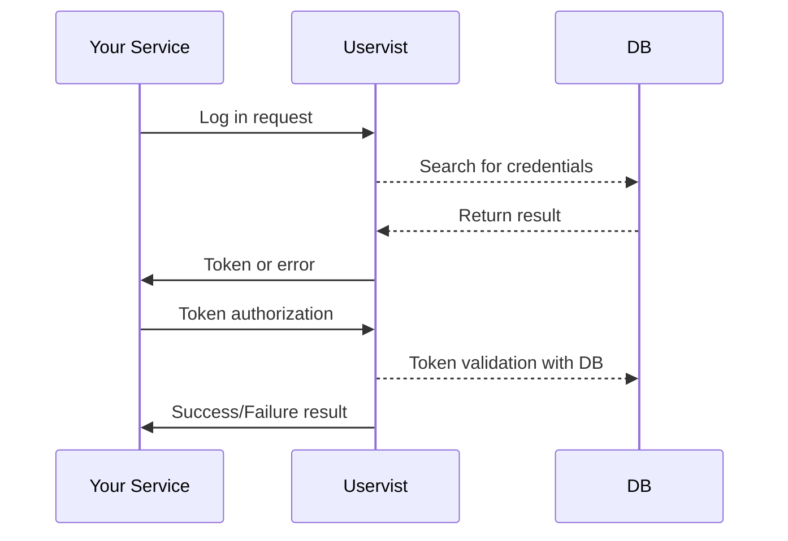

# Uservist

#### Requirements

- Java 14+
- Gradle 6+
- Docker (preferred)
- Go (preferred)

## About

Uservist is a simple local service, or better say a group of services that can be used to manage users for multiple services.
This projects consists of several modules.

1. **uservist-service** is the main Java service that handles all requests and logic.
2. **uservist-api** - this project contains several modules that are built into libraries. Those include the **api** module, **sdk** and **ui**. The last one builds static html files that can be hosted on your server to provide documentation information for the service.
3. **uservist-frontend** as can be understood from the name this service uses React to provide administrative access to the main service. You are able to manage users and services within this interface. 

## Uservist Service

The main service provide an easy configuration through the properties files in the resources folder of the Java project.

#### Service Config
| Property | Value | Description |
|--|--|--|
| Port | 9090 | Service runns at this port by default |
| CORS Origins | http://localhost:9080 | Allowed origins to access this service |
| Token Name | Authorization | The name of the token header |
| Token Prefix | "Bearer " | (note the trailing space) prefix for auth token |

#### DB Config
This projects also uses a database. You are required to host a PostgreSQL server and change to your preferred database in the properties.
The service uses two schemas inside the database:

-  **users** - used to store main tables
-  **users_lb** - used to store liquibase migrations tables

#### Frontend Config
When deploying the service you can also deploy and host the frontend interface that is available in **uservist-frontend** project. By default it is hosted via **http://localhost:9080** url. You can change it in the **.env** file or while hosting the build folder.

## Preffered Service Chain

It is advised to use such chain architecture while using the **uservist** service.
All requests from the user interface or other services are done through the REST API made available. You can configure to compile desired SDK in the **uservist-api** project under the **swagger-sdk** module.

